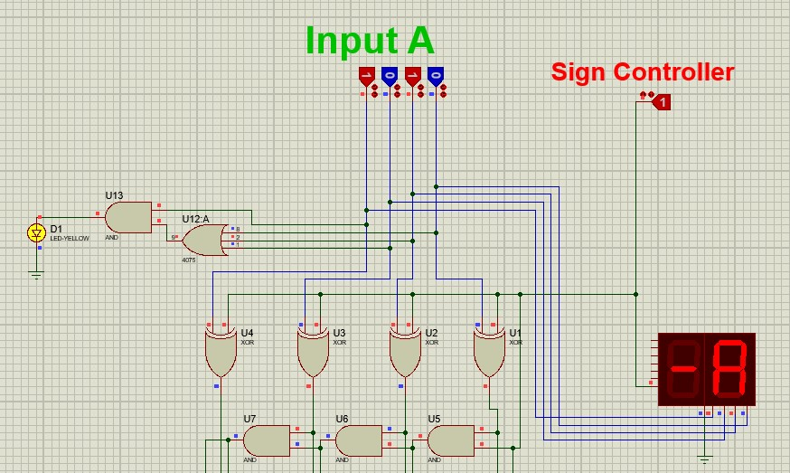

# Adder-Subtractor-in-One-Unit
### This is a circuit designed in proteus. This circuit is for Adder-Subtractor in One Unit for Signed Mechanism. This will detect Overflow of ouput and also will check Invalid inputs. When detect invalid input, an LED will be turned ON to show Invalid Input. Similarly, for Overflow of output, an LED will be turned ON to show that Output is overflowed.

## Components
- 2's Compliment Circuit (for -ve Inputs)
- Adder Subtractor in One Unit

## Overflow Detection
### When You will enter invalid input (e.g. for 4-Bit Signed Digits -8 to +7), LED will be turned on to show invalid input as show in the image below.

#### 10 is invalid input for 4-Bit Signed Input (-10)

## Output Sample 1

## Output Sample 2

## Output Sample 3

